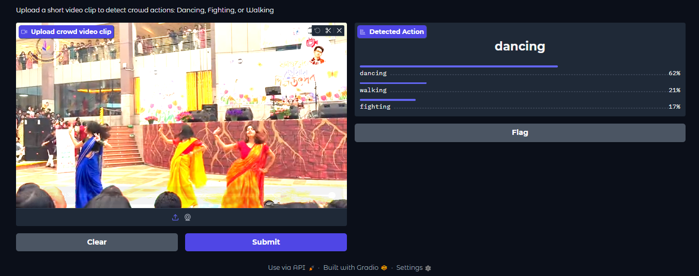
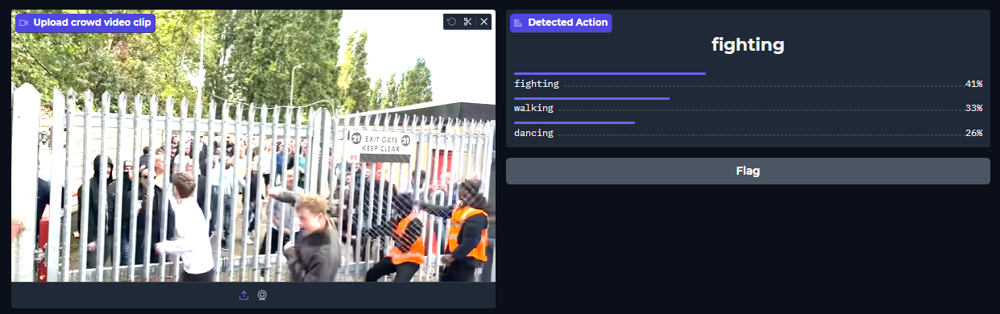
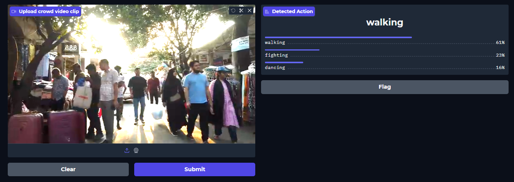
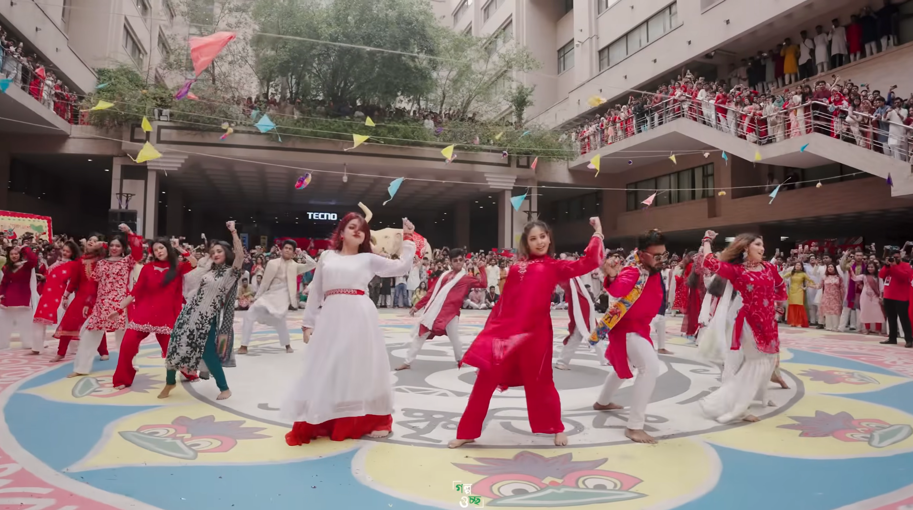
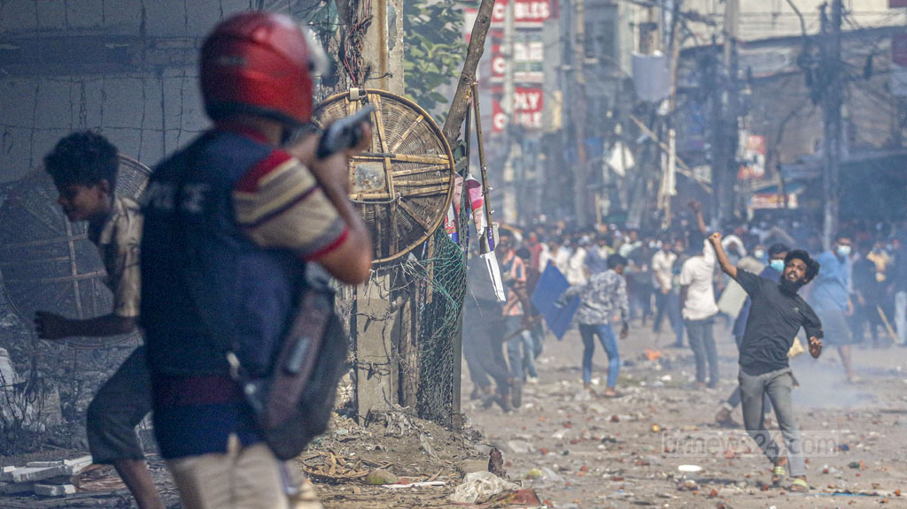
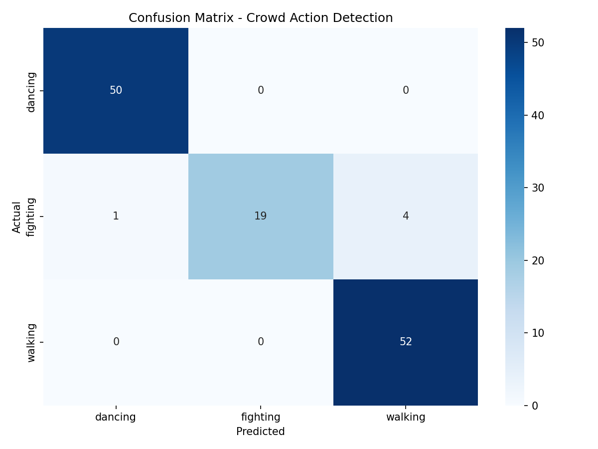

# Crowd Action Detection using Vision-Language Model (VLM)

   

A deep learning project that detects human actions in crowded scenes using OpenAI's CLIP (Contrastive Language-Image Pretraining) as a Vision-Language Model backbone. The system can classify crowd actions in real-time from video clips.

---

## Demo

Upload a short video clip to the Gradio web interface and get instant action predictions with confidence scores.

### Dancing Detection


### Fighting Detection


### Walking Detection


---

## Sample Training Data

| Dancing | Fighting | Walking |
|---|---|---|
|  |  |  |
| NSU Pahela Baishakh Flashmob | July 2024 Uprising Footage | Dhaka Gulistan Street |

---

## Classes Detected

| Class | Description | Example Source |
|---|---|---|
| Dancing | Flashmob, street dance, cultural events | NSU Pahela Baishakh Flashmob |
| Fighting | Crowd conflict, pushing, brawling | July 2024 Uprising footage |
| Walking | Normal crowd movement, busy streets | Dhaka Gulistan, Sadarghat |

---

## Results

| Metric | Score |
|---|---|
| Test Accuracy | **96%** |
| Dancing F1 | **99%** |
| Walking F1 | **96%** |
| Fighting F1 | **88%** |
| Val Accuracy (best epoch) | **98.4%** |

### Confusion Matrix


The model performs perfectly on dancing and walking classes. Fighting has minor confusion with walking (4 clips) due to the similarity between fast crowd movement and conflict scenes — which is expected behavior.

---

## Project Structure

```
Crowd-action-detection-VLM/
│
├── data/
│   ├── raw/
│   │   ├── dancing/        # 298 video clips (6-sec each)
│   │   ├── fighting/       # 196 video clips (8-sec each)
│   │   └── walking/        # 343 video clips (6-sec each)
│   ├── frames/             # Extracted frames (224x224 JPG)
│   ├── train.csv           # 585 clips (70%)
│   ├── val.csv             # 126 clips (15%)
│   └── test.csv            # 126 clips (15%)
│
├── models/
│   └── best_model.pth      # Trained model weights
│
├── results/
│   ├── confusion_matrix.png
│   ├── demo_dancing.png
│   ├── demo_fighting.png
│   ├── demo_walking.png
│   ├── sample_dancing.jpg
│   ├── sample_fighting.jpg
│   └── sample_walking.jpg
│
├── config.py               # Project settings
├── preprocess.py           # Video to frames pipeline
├── train.py                # Model training script
├── evaluate.py             # Evaluation + confusion matrix
├── demo.py                 # Gradio web demo
└── requirements.txt        # Python dependencies
```

---

## Architecture

```
Video Clip
    ↓
Frame Extraction (2 fps, 224×224)
    ↓
CLIP ViT-B/32 Visual Encoder (frozen)
    ↓
512-dim Feature Vector
    ↓
Custom Classifier Head
    Linear(512 → 256) → ReLU → Dropout(0.3) → Linear(256 → 3)
    ↓
Action Prediction (dancing / fighting / walking)
```

### Why CLIP?
CLIP is a Vision-Language Model pretrained on 400 million image-text pairs. Its visual encoder produces rich semantic features that generalize well to action recognition without requiring full fine-tuning. We freeze the CLIP backbone and only train a lightweight classifier head — making training fast and efficient on consumer GPUs.

---

## Dataset

### Data Collection
- **YouTube**: Downloaded using `yt-dlp` with keyword searches per class
- **Real-world footage**: July 2024 Bangladesh Uprising clips (fighting class)
- **Cultural events**: NSU, IUB Pahela Baishakh Flashmob videos (dancing class)
- **Street footage**: Dhaka Gulistan, Sadarghat walking tours (walking class)

### Preprocessing Pipeline
1. Videos downloaded and renamed (no spaces/special characters)
2. Cut into 6-8 second clips using `ffmpeg`
3. Frames extracted at 2 fps, resized to 224×224
4. Auto-labeled by folder name
5. Split 70/15/15 into train/val/test

### Dataset Statistics
```
Total clips  : 837
Training     : 585 clips
Validation   : 126 clips
Test         : 126 clips
```

---

## Installation

### Requirements
- Python 3.11
- CUDA-compatible GPU (tested on RTX 3060 12GB)
- 20+ GB free disk space

### Setup

```bash
# Clone the repository
git clone https://github.com/YOURUSERNAME/Crowd-action-detection-VLM.git
cd Crowd-action-detection-VLM

# Create virtual environment
python -m venv venv

# Activate (Windows)
venv\Scripts\activate

# Install PyTorch with CUDA
pip install torch torchvision --index-url https://download.pytorch.org/whl/cu121

# Install all dependencies
pip install -r requirements.txt
```

### Install ffmpeg (Windows)
Download from [ffmpeg.org](https://ffmpeg.org/download.html) and add the `bin` folder to your system PATH.

---

## Usage

### 1. Prepare your data
Place video files in the correct class folders:
```
data/raw/dancing/    ← dancing videos
data/raw/fighting/   ← fighting videos
data/raw/walking/    ← walking videos
```

### 2. Preprocess
```bash
python preprocess.py
```
Extracts frames from all videos and creates train/val/test CSV splits.

### 3. Train
```bash
python train.py
```
Trains the CLIP classifier for 10 epochs. Best model saved to `models/best_model.pth`.

### 4. Evaluate
```bash
python evaluate.py
```
Runs evaluation on test set and saves confusion matrix to `results/`.

### 5. Run Demo
```bash
python demo.py
```
Opens Gradio web interface at `http://localhost:7860`. Upload any video clip to get action predictions.

---

## Training Details

| Parameter | Value |
|---|---|
| Base Model | CLIP ViT-B/32 |
| Backbone | Frozen |
| Classifier | Linear(512→256→3) |
| Optimizer | Adam |
| Learning Rate | 1e-4 |
| Batch Size | 32 |
| Epochs | 10 |
| LR Scheduler | StepLR (step=3, gamma=0.5) |
| GPU | RTX 3060 12GB |
| Training Time | ~30 minutes |

### Training Progress

| Epoch | Train Acc | Val Acc |
|---|---|---|
| 1 | 69.9% | 87.3% |
| 2 | 87.9% | 92.9% |
| 3 | 91.8% | 96.8% |
| 4 | 94.5% | 98.4% ← best |
| 5 | 96.1% | 98.4% |
| 10 | 97.9% | 98.4% |

---

## Limitations

- Model only detects 3 action classes — actions outside these (e.g. clapping, taking photos) will be forced into one of the 3 classes with low confidence
- Fighting class has slight confusion with fast walking/running crowds — expected due to visual similarity
- Performance may vary on aerial/top-down camera angles not seen during training
- Black and white footage may reduce accuracy since model was trained on colorful videos

---

## Future Work

- Add more action classes: clapping, taking photos, medical emergency
- Implement multi-person detection using YOLOv8 + CLIP pipeline for per-person action labeling
- Add temporal modeling across multiple frames for better accuracy
- Real-time CCTV integration with sliding window inference
- Deploy as a web application with FastAPI backend

---

## Tech Stack

| Tool | Purpose |
|---|---|
| Python 3.11 | Core language |
| PyTorch 2.5.1 | Deep learning framework |
| OpenAI CLIP | Vision-Language Model backbone |
| OpenCV | Video processing |
| ffmpeg | Video cutting and frame extraction |
| yt-dlp | YouTube data collection |
| Gradio | Web demo interface |
| scikit-learn | Evaluation metrics |
| Matplotlib/Seaborn | Visualization |

---

## Acknowledgements

- [OpenAI CLIP](https://github.com/openai/CLIP) — Vision-Language Model
- [UCF-101 Dataset](https://www.crcv.ucf.edu/data/UCF101.php) — Action recognition benchmark
- NSU & IUB Cultural Organizations — Flashmob footage
- July 2024 Bangladesh Uprising documentation footage

---

## License

This project is for academic/educational purposes only. Video data used for training is sourced from publicly available YouTube content.

---

## Author

**Syed Tahmid Manzoor**  
Department of Computer Science and Engineering  
North South University  
GitHub: [SayeedTahmid](https://github.com/SayeedTahmid/Crowd-action-detection-VLM)
